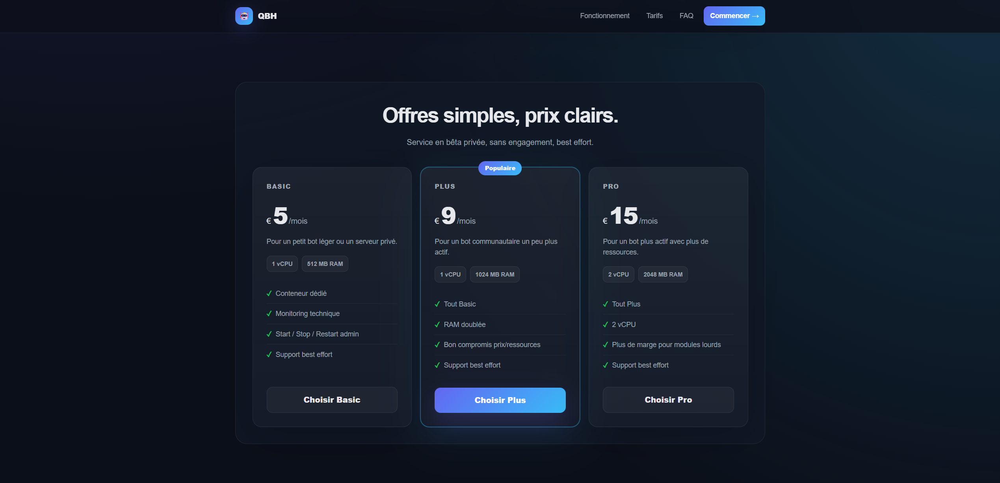
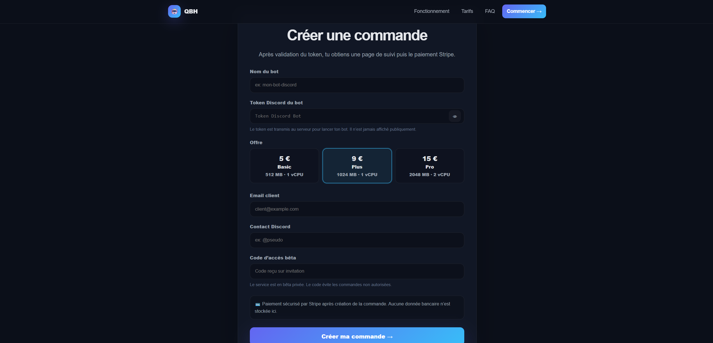
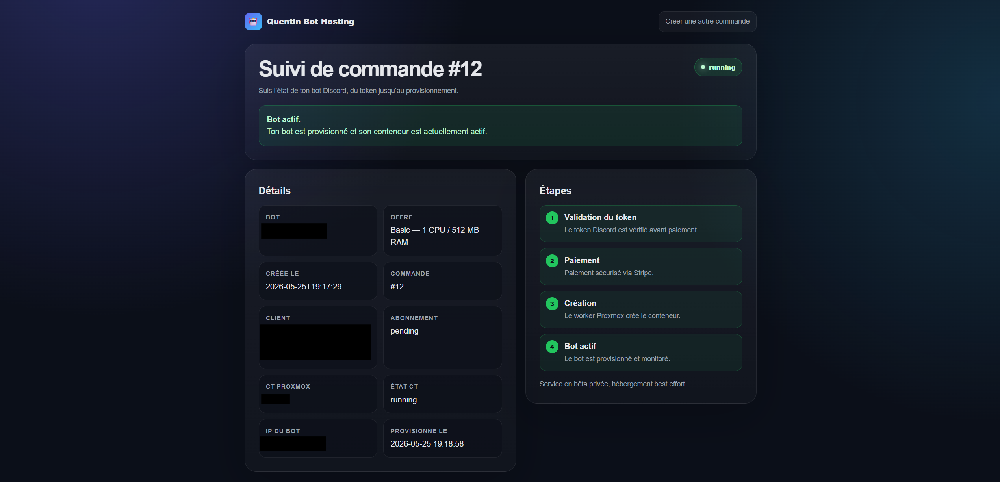
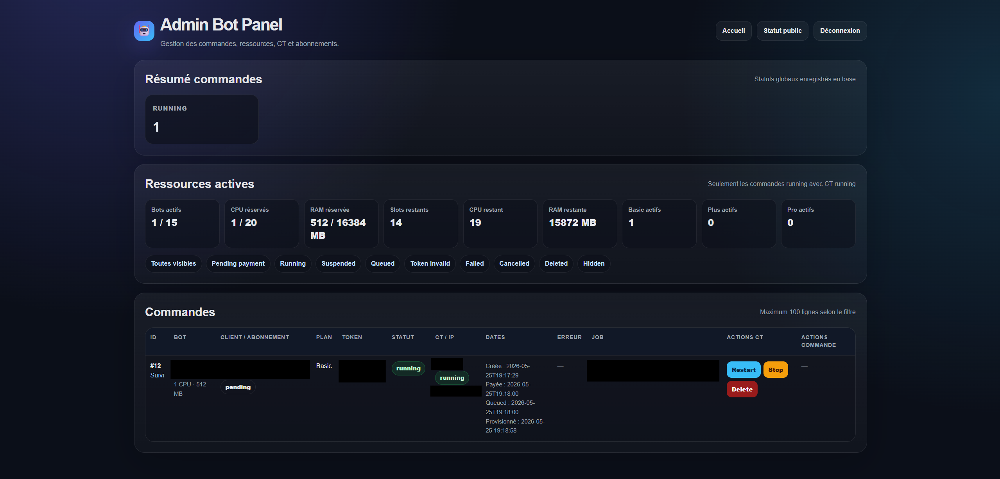
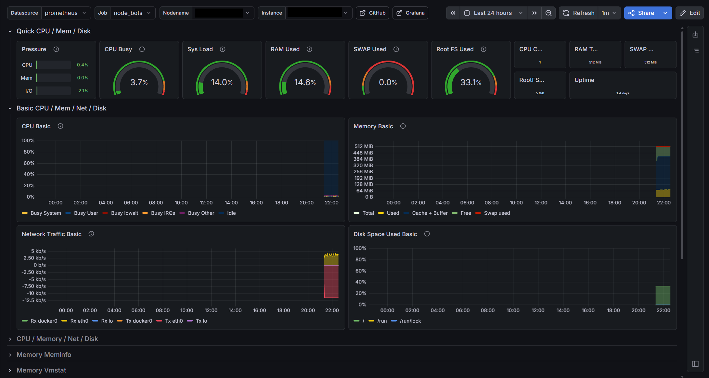

# Proxmox Discord Bot Hosting Platform

Automated Discord bot hosting platform built on a Proxmox homelab.

This project provisions Discord bots into isolated LXC containers, exposes a customer order flow through a Flask web panel, integrates Stripe Checkout/Webhooks for subscription lifecycle management, and monitors provisioned containers dynamically with Prometheus and Grafana.

> This repository is a portfolio/documentation version of the project. Production secrets, private configuration files, customer data and internal backups are intentionally excluded.

## Features

- Flask customer panel with Basic / Plus / Pro plans
- Private beta access code
- Discord bot token validation before provisioning
- Stripe Checkout subscription flow
- Stripe webhook automation
- Automatic LXC provisioning on Proxmox
- Bash workers managed by systemd
- Admin dashboard for orders and container actions
- Automatic suspension when a Stripe subscription is cancelled
- Prometheus dynamic file service discovery
- Grafana Node Exporter monitoring per bot container
- Clean backup/versioning workflow

## Stack

- Proxmox VE
- LXC containers
- Debian
- Flask
- SQLite
- Gunicorn
- Stripe Checkout / Webhooks
- Bash
- systemd
- Prometheus
- Grafana
- Node Exporter
- Tailscale Funnel

## Current Status

This is a private beta / homelab project.

The platform currently supports order creation, beta access protection, rate limiting, Stripe subscription flow, automatic container provisioning, automatic suspension on subscription cancellation, dynamic Prometheus/Grafana monitoring, and an admin dashboard for lifecycle management.

## Security Notes

This repository does not include production secrets.

Never commit Discord bot tokens, Stripe API keys, webhook secrets, admin passwords, Flask secret keys, SQLite production databases, internal backups, private IPs or internal URLs.

## Roadmap

- Add customer documentation for Discord bot token creation
- Improve client-facing order status page
- Add email notifications
- Add upgrade/downgrade plan handling
- Add stronger token encryption at rest
- Add per-client dashboard access
- Improve deployment automation

## Screenshots

### Landing page

### Order creation

### Order tracking

### Admin dashboard

### Grafana monitoring

## Documentation

Additional project documentation is available in the `docs/` directory:

- [Architecture](docs/architecture.md)
- [Architecture Diagram](docs/architecture-diagram.md)
- [Security](docs/security.md)
- [Security Design](docs/security-design.md)
- [Monitoring](docs/monitoring.md)
- [Incident Recovery](docs/incident-recovery.md)
- [Lessons Learned](docs/lessons-learned.md)
- [Roadmap](docs/roadmap.md)

## Example Scripts

The `scripts/` directory contains sanitized examples of the automation scripts used in the project.

These scripts are provided for portfolio and documentation purposes only. They do not contain production paths, secrets, tokens, customer data or internal IP addresses.

Available examples:

- [create-bot.example.sh](scripts/create-bot.example.sh)
- [bot-worker.example.sh](scripts/bot-worker.example.sh)
- [bot-action-worker.example.sh](scripts/bot-action-worker.example.sh)
- [generate-bots-sd.example.sh](scripts/generate-bots-sd.example.sh)
- [sync-bot-orders.example.sh](scripts/sync-bot-orders.example.sh)

## Project Status

This project is a homelab / private beta portfolio project.

It is not presented as a production-ready hosting platform with guaranteed availability.

The main goal is to demonstrate practical skills in:

- system administration
- virtualization
- automation
- monitoring
- documentation
- infrastructure troubleshooting

## License

This project is released under the MIT License.

See [LICENSE](LICENSE) for details.

## Contributing

This repository is mainly a portfolio and documentation project.

Feedback and suggestions are welcome, but the repository does not include production secrets, private configuration files, customer data or internal backups.

See [CONTRIBUTING.md](CONTRIBUTING.md) for more details.

## Sanitized Flask Panel Example

A sanitized Flask/SQLite example is available in [`app/`](app/).

It demonstrates the order workflow used by the panel:

- bot order creation
- bot name sanitization
- Discord token preview instead of full token storage
- SQLite order storage
- admin status updates
- example statuses such as `pending_validation`, `approved`, `queued`, `running` and `failed`

This example intentionally excludes production secrets, real Discord tokens, payment provider credentials and private Proxmox details.
